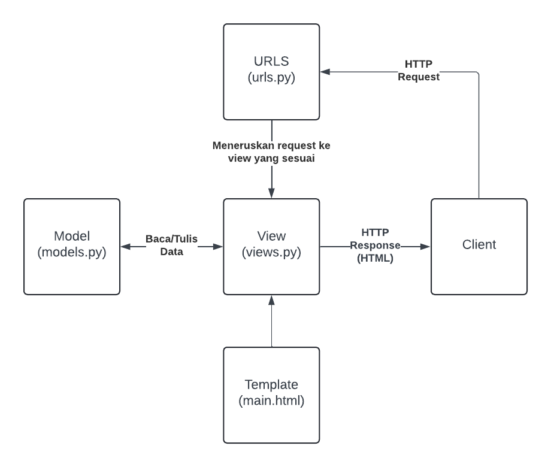

# Shield

Tautan aplikasi PWS: http://anders-willard-shield.pbp.cs.ui.ac.id/

## Implementasi Checklist

1. Membuat direktori baru dengan nama ```shield```.
2. Membuat dan mengaktifkan _virtual environment_ dengan perintah berikut.
    ```bash
    python -m venv env
    env\Scripts\activate
    ```
3. Menambahkan beberapa _dependencies_ pada ```requirements.txt```.
    ```bash
    django
    gunicorn
    whitenoise
    psycopg2-binary
    requests
    urllib3
    ```
4. Melakukan instalasi _dependencies_ pada ```requirements.txt``` dengan perintah berikut.
    ```bash
    pip install -r requirements.txt
    ```
5. Membuat proyek Django bernama ```shield``` dengan perintah berikut.
    ```bash
    django-admin startproject shield .
    ```
6. Menambahkan ```localhost``` dan  ```127.0.0.1``` pada ```ALLOWED_HOSTS``` pada ```settings.py```.
7. Membuat berkas ```main.html``` pada direktori baru ```templates``` dengan kode berikut.
    ```html
    <h1>{{ app_name }}</h1>

    <h3>Name: </h3>
    <p>{{ name }}<p>
    <h3>Class: </h3>
    <p>{{ class }}<p>
    ```
8. Mengisi berkas ```models.py``` pada direktori ```main``` dengan kode berikut.
    ```py
    from django.db import models

    class Product(models.Model):
        name = models.CharField(max_length=255)
        price = models.IntegerField()
        description = models.TextField()
    ```
9. Melakukan migrasi model dengan perintah berikut.
    ```bash
    python manage.py makemigrations
    python manage.py migrate
    ```
10. Mengisi berkas ```views.py``` pada direktori ```main``` dengan kode berikut.
    ```py
    from django.shortcuts import render

    def show_main(request):
        context = {
            'app_name': 'Shield',
            'name': 'Anders Willard Leo',
            'class': 'PBP E'
        }

        return render(request, "main.html", context)
    ```
11. Mengonfigurasi _routing_ URL aplikasi ```main``` dengan mengisi berkas ```urls.py``` pada direktori ```main``` dengan kode berikut.
    ```py
    from django.urls import path
    from main.views import show_main

    app_name = 'main'

    urlpatterns = [
        path('', show_main, name='show_main'),
    ]
    ```
12. Mengonfigurasi _routing_ URL proyek dengan mengisi berkas ```urls.py``` pada direktori ```shield``` dengan kode berikut.
    ```py
    from django.contrib import admin
    from django.urls import path, include

    urlpatterns = [
        path('admin/', admin.site.urls),
        path('', include('main.urls')),
    ]
    ```
13. Memastikan aplikasi sudah berjalan dengan benar pada _local deployment_ dengan perintah berikut.
    ```bash
    python manage.py runserver
    ```
14. Membuat proyek baru dengan nama ```shield``` pada PWS.
15. Menambahkan ```anders-willard-shield.pbp.cs.ui.ac.id``` pada ```ALLOWED_HOSTS``` pada ```settings.py```.
16. Unggah proyek ke repositori GitHub baru bernama ```shield```.
17. Melakukan _deployment_ melalui PWS.

## Bagan Arsitektur Django



## Fungsi ```git``` dalam pengembangan perangkat lunak

Git adalah sistem kontrol versi yang sering digunakan dalam pengembangan perangkat lunak. Beberapa fungsi utama git adalah pengelolaan versi, kolaborasi, dan branching. Pengelolaan versi memungkinkan pengembang untuk menyimpan versi kode yang berbeda dan mengembalikan kode ke versi selanjutnya jika diperlukan. Kolaborasi memungkinkan beberapa pengembang untuk bekerja pada proyek yang sama tanpa mengganggu pekerjaan satu sama lain. Branching memungkinkan pengembang untuk membuat cabang baru yang terpisah untuk mengembangkan fitur yang baru tanpa mengganggu cabang utama.

## Alasan menggunakan framework Django sebagai permulaan pembelajaran perangkat lunak

Menurut saya, Django digunakan sebagai permulaan pembelajaran perangkat lunak adalah karena Django menggunakan arsitektur Model-Template-Views (MTV) yang memungkinkan pengembang web untuk mengelola dan mengorganisasi kode dengan lebih terstruktur. Dengan Django, pengembang dapat membuat aplikasi web yang lebih terstruktur dan mudah dikelola.

## Alasan model pada Django disebut sebagai ORM

Model pada Django disebut sebagai Object-Relational Mapping (ORM) adalah karena model adalah bagian dari kerangka kerja Django yang bertanggung jawab untuk memetakan objek Python ke struktur basis data relasional. Melalui ORM, pengembang dapat membuat definisi model dalam Python yang mewakili tabel database dan melakukan interaksi dengan data melalui operasi objek Python tanpa menulis kueri SQL secara manual.