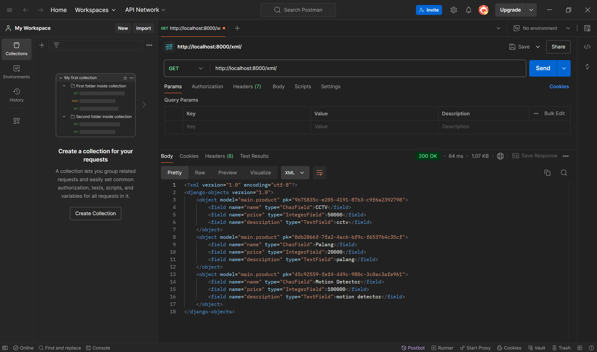
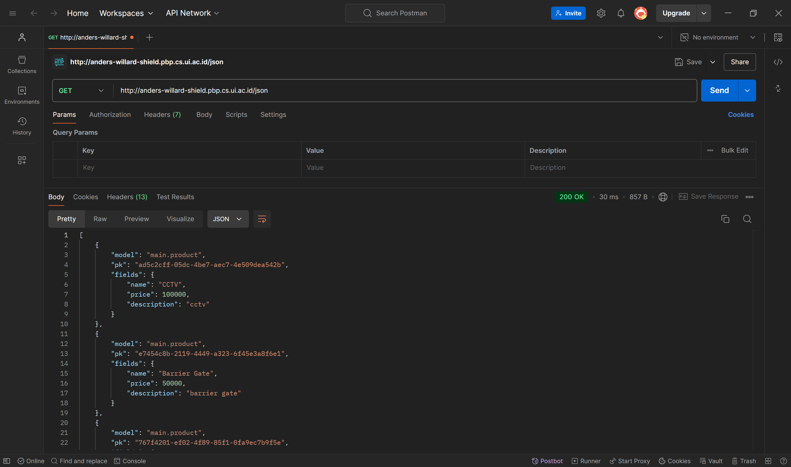
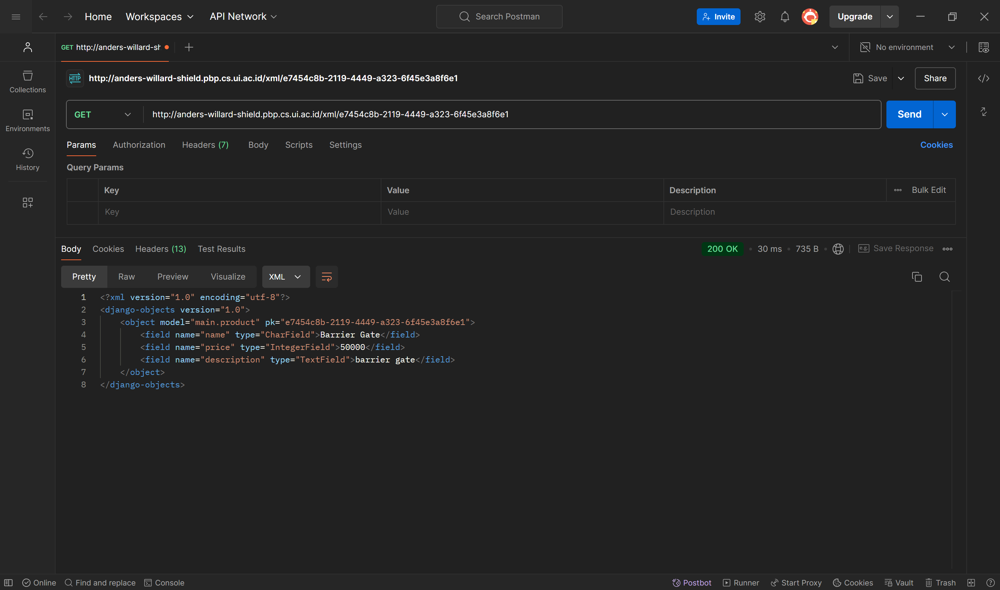
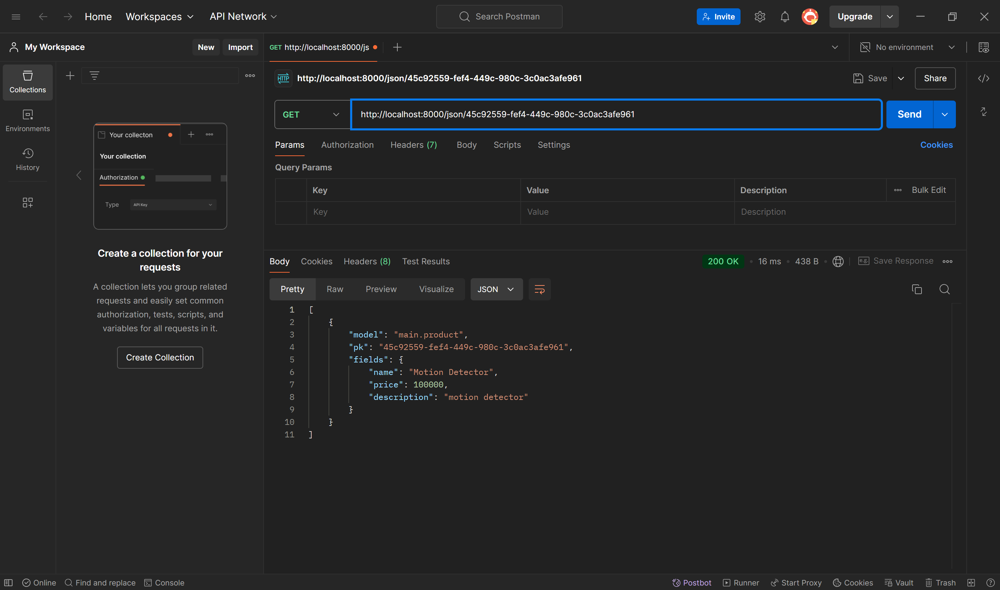

# Shield

Tautan aplikasi PWS: http://anders-willard-shield.pbp.cs.ui.ac.id/

## Tugas 2

### Implementasi Checklist

1. Membuat direktori baru dengan nama ```shield```.
2. Membuat dan mengaktifkan _virtual environment_ dengan perintah berikut.
    ```bash
    python -m venv env
    env\Scripts\activate
    ```
3. Menambahkan beberapa _dependencies_ pada ```requirements.txt```.
    ```bash
    django
    gunicorn
    whitenoise
    psycopg2-binary
    requests
    urllib3
    ```
4. Melakukan instalasi _dependencies_ pada ```requirements.txt``` dengan perintah berikut.
    ```bash
    pip install -r requirements.txt
    ```
5. Membuat proyek Django bernama ```shield``` dengan perintah berikut.
    ```bash
    django-admin startproject shield .
    ```
6. Menambahkan ```localhost``` dan  ```127.0.0.1``` pada ```ALLOWED_HOSTS``` pada ```settings.py```.
7. Membuat berkas ```main.html``` pada direktori baru ```templates``` dengan kode berikut.
    ```html
    <h1>{{ app_name }}</h1>

    <h3>Name: </h3>
    <p>{{ name }}<p>
    <h3>Class: </h3>
    <p>{{ class }}<p>
    ```
8. Mengisi berkas ```models.py``` pada direktori ```main``` dengan kode berikut.
    ```py
    from django.db import models

    class Product(models.Model):
        name = models.CharField(max_length=255)
        price = models.IntegerField()
        description = models.TextField()
    ```
9. Melakukan migrasi model dengan perintah berikut.
    ```bash
    python manage.py makemigrations
    python manage.py migrate
    ```
10. Mengisi berkas ```views.py``` pada direktori ```main``` dengan kode berikut.
    ```py
    from django.shortcuts import render

    def show_main(request):
        context = {
            'app_name': 'Shield',
            'name': 'Anders Willard Leo',
            'class': 'PBP E'
        }

        return render(request, "main.html", context)
    ```
11. Mengonfigurasi _routing_ URL aplikasi ```main``` dengan mengisi berkas ```urls.py``` pada direktori ```main``` dengan kode berikut.
    ```py
    from django.urls import path
    from main.views import show_main

    app_name = 'main'

    urlpatterns = [
        path('', show_main, name='show_main'),
    ]
    ```
12. Mengonfigurasi _routing_ URL proyek dengan mengisi berkas ```urls.py``` pada direktori ```shield``` dengan kode berikut.
    ```py
    from django.contrib import admin
    from django.urls import path, include

    urlpatterns = [
        path('admin/', admin.site.urls),
        path('', include('main.urls')),
    ]
    ```
13. Memastikan aplikasi sudah berjalan dengan benar pada _local deployment_ dengan perintah berikut.
    ```bash
    python manage.py runserver
    ```
14. Membuat proyek baru dengan nama ```shield``` pada PWS.
15. Menambahkan ```anders-willard-shield.pbp.cs.ui.ac.id``` pada ```ALLOWED_HOSTS``` pada ```settings.py```.
16. Unggah proyek ke repositori GitHub baru bernama ```shield```.
17. Melakukan _deployment_ melalui PWS.

### Bagan Arsitektur Django


### Fungsi ```git``` dalam pengembangan perangkat lunak

Git adalah sistem kontrol versi yang sering digunakan dalam pengembangan perangkat lunak. Beberapa fungsi utama git adalah pengelolaan versi, kolaborasi, dan branching. Pengelolaan versi memungkinkan pengembang untuk menyimpan versi kode yang berbeda dan mengembalikan kode ke versi selanjutnya jika diperlukan. Kolaborasi memungkinkan beberapa pengembang untuk bekerja pada proyek yang sama tanpa mengganggu pekerjaan satu sama lain. Branching memungkinkan pengembang untuk membuat cabang baru yang terpisah untuk mengembangkan fitur yang baru tanpa mengganggu cabang utama.

### Alasan menggunakan framework Django sebagai permulaan pembelajaran perangkat lunak

Menurut saya, Django digunakan sebagai permulaan pembelajaran perangkat lunak adalah karena Django menggunakan arsitektur Model-Template-Views (MTV) yang memungkinkan pengembang web untuk mengelola dan mengorganisasi kode dengan lebih terstruktur. Dengan Django, pengembang dapat membuat aplikasi web yang lebih terstruktur dan mudah dikelola.

### Alasan model pada Django disebut sebagai ORM

Model pada Django disebut sebagai Object-Relational Mapping (ORM) adalah karena model adalah bagian dari kerangka kerja Django yang bertanggung jawab untuk memetakan objek Python ke struktur basis data relasional. Melalui ORM, pengembang dapat membuat definisi model dalam Python yang mewakili tabel database dan melakukan interaksi dengan data melalui operasi objek Python tanpa menulis kueri SQL secara manual.

## Tugas 3

### Alasan _data delivery_ diperlukan dalam pengimplementasian sebuah platform

_Data delivery_ diperlukan dalam pengimplementasian sebuah _platform_ karena ada kalanya dimana kita perlu mengirimkan data dari satu _stack_ ke _stack_ yang lain. Tanpa _data delivery_ yang baik, platform akan mengalami kesulitan dalam mengelola pengiriman data, yang dapat menyebabkan ketidakkonsistenan data dan masalah keamanan.

### XML or JSON

Menurutku, JSON lebih baik dari XML karena lebih universal dan mudah dibaca oleh manusia. Meskipun XML dan JSON memiliki kelebihan masing-masing, JSON cenderung lebih populer untuk banyak kasus penggunaan. JSON lebih ringkas dan mudah dibaca oleh manusia. Selain itu, JSON memiliki ukuran _file_ yang lebih kecil dan mendukung tipe data yang umum digunakan sehingga lebih populer dibandingkan XML dan menjadi pilihan banyak orang.

### Fungsi dari `is_valid()` saat membuat form di Django dan alasan kita membutuhkan method tersebut

Fungsi dari `is_valid()` saat membuat form di Django adalah untuk memvalidasi data yang dimasukkan ke dalam form. Fungsi tersebut memastikan data tersebut sesuai dengan aturan form yang telah ditentukan. Kita membutuhkan method ini untuk menjaga format data dan mencegah masuknya data yang tidak valid atau berbahaya.

### Alasan `csrf_token` dibutuhkan saat membuat form di Django

`csrf_token` dibutuhkan saat membuat form di Django untuk melindungi aplikasi dari serangan CSRF dan memverifikasi bahwa permintaan berasal dari sumber yang telah ditentukan. Jika tidak menambahkan `csrf_token`, siapapun dapat mengakses form tersebut dan aplikasi akan menjadi rentan terhadap serangan di mana penyerang dapat memanipulasi aksi pengguna tanpa sepengetahuan mereka. Penggunaan `csrf_token` sangat penting untuk menjaga keamanan aplikasi dan melindungi pengguna dari berbagai jenis serangan berbahaya.

### Implementasi Checklist

1. Mengubah _primary key_ dari _integer_ menjadi UUID dengan mengubah berkas `models.py` pada direktori `main`.
    ```py
    import uuid
    from django.db import models

    class Product(models.Model):
        id = models.UUIDField(primary_key=True, default=uuid.uuid4, editable=False)
        name = models.CharField(max_length=255)
        price = models.IntegerField()
        description = models.TextField()
    ```
2. Melakukan migrasi model dengan perintah berikut.
    ```bash
    python manage.py makemigrations
    python manage.py migrate
    ```
3. Membuat form input data dengan membuat berkas baru `forms.py` pada direktori `main` dengan kode berikut.
    ```py
    from django.forms import ModelForm
    from main.models import Product

    class ProductForm(ModelForm):
        class Meta:
            model = Product
            fields = ["name", "price", "description"]
    ```
4. Mengubah fungsi `show_main` dan menambahkan fungsi `create_product`, `show_xml`, `show_json`, `show_xml_by_id`, dan `show_json_by_id`  pada berkas `views.py`.
    ```py
    from django.shortcuts import render, redirect
    from main.forms import ProductForm
    from main.models import Product

    def show_main(request):
        products = Product.objects.all()
        
        context = {
            'app_name': 'Shield',
            'name': 'Anders Willard Leo',
            'class': 'PBP E',
            'products': products
        }

        return render(request, "main.html", context)

    def create_product(request):
        form = ProductForm(request.POST or None)

        if form.is_valid() and request.method == "POST":
            form.save()
            return redirect('main:show_main')

        context = {'form': form}
        return render(request, "create_product.html", context)
    
    def show_xml(request):
        data = Product.objects.all()
        return HttpResponse(serializers.serialize("xml", data), content_type="application/xml")

    def show_json(request):
        data = Product.objects.all()
        return HttpResponse(serializers.serialize("json", data), content_type="application/json")

    def show_xml_by_id(request, id):
        data = Product.objects.filter(pk=id)
        return HttpResponse(serializers.serialize("xml", data), content_type="application/xml")

    def show_json_by_id(request, id):
        data = Product.objects.filter(pk=id)
        return HttpResponse(serializers.serialize("json", data), content_type="application/json")
    ```
5. Menambahkan _path_ URL untuk fungsi-fungsi tersebut ke dalam `url_patterns` pada berkas `urls.py` dengan kode berikut.
    ```py
    from django.urls import path
    from main.views import show_main, create_product, show_xml, show_json, show_xml_by_id, show_json_by_id

    app_name = 'main'

    urlpatterns = [
        path('', show_main, name='show_main'),
        path('create-product', create_product, name='create_product'),
        path('xml/', show_xml, name='show_xml'),
        path('json/', show_json, name='show_json'),
        path('xml/<str:id>/', show_xml_by_id, name='show_xml_by_id'),
        path('json/<str:id>/', show_json_by_id, name='show_json_by_id'),
    ]
    ```
6. Membuat berkas HTML baru bernama `create_product.html` pada direktori `main/templates` dengan kode berikut.
    ```html
     
    
    <h1>Add New Product</h1>

    <form method="POST">
    
    <table>
        {{ form.as_table }}
        <tr>
        <td></td>
        <td>
            <input type="submit" value="Add Product" />
        </td>
        </tr>
    </table>
    </form>

    
    ```
7. Menambahkan kode untuk menampilkan data _product_ dalam bentuk tabel serta tombol "Add New Product" yang akan redirect ke halaman `create_product` pada `main.html` pada direktori `main/templates`.
    ```html
    
    
    <h1>{{ app_name }}</h1>

    <h3>Name: </h3>
    <p>{{ name }}<p>
    <h3>Class: </h3>
    <p>{{ class }}<p>

    
    <p>Belum ada product.</p>
    
    <table>
        <tr>
            <th>Product Name</th>
            <th>Price</th>
            <th>Description</th>
        </tr>

        
        <tr>
            <td>{{product.name}}</td>
            <td>{{product.price}}</td>
            <td>{{product.description}}</td>
        </tr>
        
    </table>
    

    <br />

    <a href="">
        <button>Add New Product</button>
    </a>
    
    ```
8. Membuat direktori `templates` pada direktori utama dan membuat berkas HTML baru bernama `base.html` dengan kode berikut.
    ```html
    
    <!DOCTYPE html>
    <html lang="en">
    <head>
        <meta charset="UTF-8" />
        <meta name="viewport" content="width=device-width, initial-scale=1.0" />
         
    </head>

    <body>
         
    </body>
    </html>
    ```
9. Mengubah isi variabel `TEMPLATES` pada `settings.py` pada direktori proyek dengan kode berikut.
    ```py
    ...
    TEMPLATES = [
        {
            'BACKEND': 'django.template.backends.django.DjangoTemplates',
            'DIRS': [BASE_DIR / 'templates'], # Tambahkan konten baris ini
            'APP_DIRS': True,
            ...
        }
    ]
    ...
    ```
10. Menambahkan `CSRF_TRUSTED_ORIGINS` pada berkas `settings.py` pada direktori proyek dengan kode berikut.
    ```py
    CSRF_TRUSTED_ORIGINS = ["http://localhost","http://127.0.0.1","http://anders-willard-shield.pbp.cs.ui.ac.id/", "https://anders-willard-shield.pbp.cs.ui.ac.id/"]
    ```
11. Melakukan `add`-`commit`-`push` ke GitHub.

### Screenshot Hasil Akses URL pada Postman 

#### XML



#### JSON



#### XML by ID



#### JSON by ID

