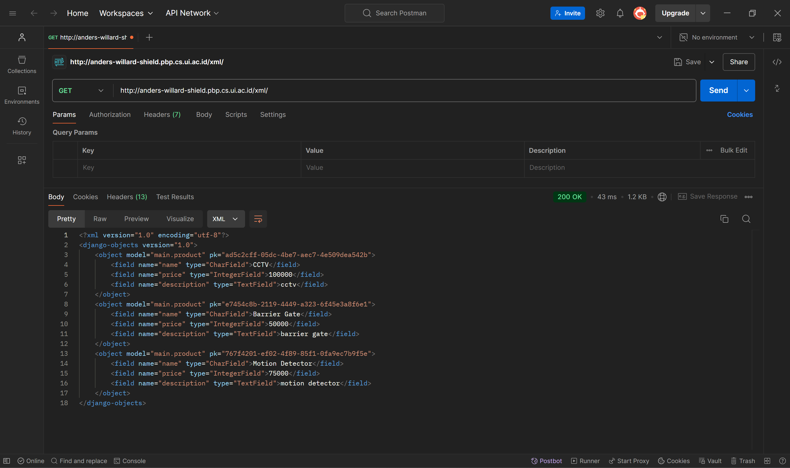
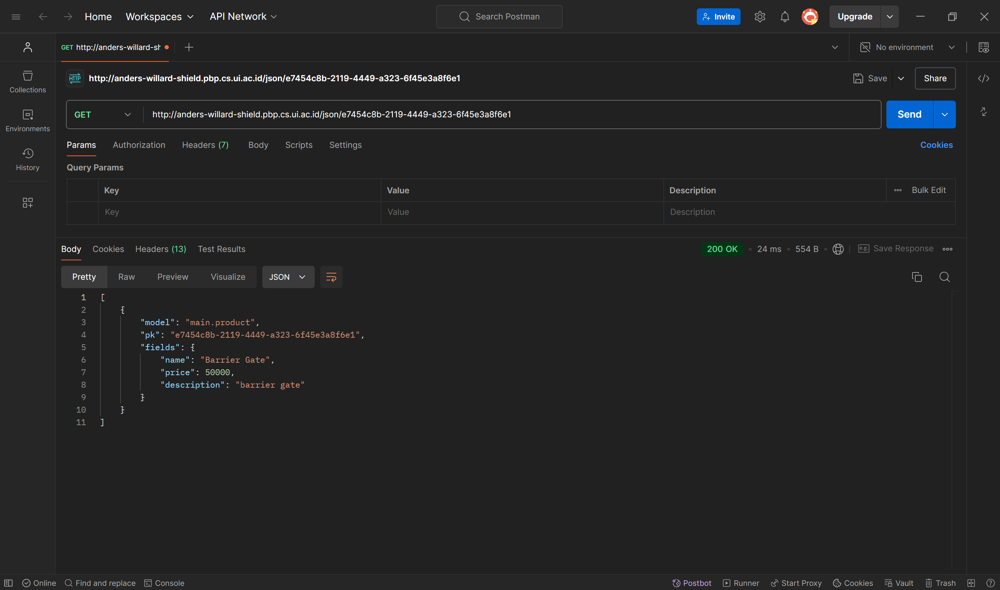

# Shield

Tautan aplikasi PWS: http://anders-willard-shield.pbp.cs.ui.ac.id/

## Tugas 2

### Implementasi Checklist

1. Membuat direktori baru dengan nama ```shield```.
2. Membuat dan mengaktifkan _virtual environment_ dengan perintah berikut.
    ```bash
    python -m venv env
    env\Scripts\activate
    ```
3. Menambahkan beberapa _dependencies_ pada ```requirements.txt```.
    ```bash
    django
    gunicorn
    whitenoise
    psycopg2-binary
    requests
    urllib3
    ```
4. Melakukan instalasi _dependencies_ pada ```requirements.txt``` dengan perintah berikut.
    ```bash
    pip install -r requirements.txt
    ```
5. Membuat proyek Django bernama ```shield``` dengan perintah berikut.
    ```bash
    django-admin startproject shield .
    ```
6. Menambahkan ```localhost``` dan  ```127.0.0.1``` pada ```ALLOWED_HOSTS``` pada ```settings.py```.
7. Membuat berkas ```main.html``` pada direktori baru ```templates``` dengan kode berikut.
    ```html
    <h1>{{ app_name }}</h1>

    <h3>Name: </h3>
    <p>{{ name }}<p>
    <h3>Class: </h3>
    <p>{{ class }}<p>
    ```
8. Mengisi berkas ```models.py``` pada direktori ```main``` dengan kode berikut.
    ```py
    from django.db import models

    class Product(models.Model):
        name = models.CharField(max_length=255)
        price = models.IntegerField()
        description = models.TextField()
    ```
9. Melakukan migrasi model dengan perintah berikut.
    ```bash
    python manage.py makemigrations
    python manage.py migrate
    ```
10. Mengisi berkas ```views.py``` pada direktori ```main``` dengan kode berikut.
    ```py
    from django.shortcuts import render

    def show_main(request):
        context = {
            'app_name': 'Shield',
            'name': 'Anders Willard Leo',
            'class': 'PBP E'
        }

        return render(request, "main.html", context)
    ```
11. Mengonfigurasi _routing_ URL aplikasi ```main``` dengan mengisi berkas ```urls.py``` pada direktori ```main``` dengan kode berikut.
    ```py
    from django.urls import path
    from main.views import show_main

    app_name = 'main'

    urlpatterns = [
        path('', show_main, name='show_main'),
    ]
    ```
12. Mengonfigurasi _routing_ URL proyek dengan mengisi berkas ```urls.py``` pada direktori ```shield``` dengan kode berikut.
    ```py
    from django.contrib import admin
    from django.urls import path, include

    urlpatterns = [
        path('admin/', admin.site.urls),
        path('', include('main.urls')),
    ]
    ```
13. Memastikan aplikasi sudah berjalan dengan benar pada _local deployment_ dengan perintah berikut.
    ```bash
    python manage.py runserver
    ```
14. Membuat proyek baru dengan nama ```shield``` pada PWS.
15. Menambahkan ```anders-willard-shield.pbp.cs.ui.ac.id``` pada ```ALLOWED_HOSTS``` pada ```settings.py```.
16. Unggah proyek ke repositori GitHub baru bernama ```shield```.
17. Melakukan _deployment_ melalui PWS.

### Bagan Arsitektur Django


### Fungsi ```git``` dalam pengembangan perangkat lunak

Git adalah sistem kontrol versi yang sering digunakan dalam pengembangan perangkat lunak. Beberapa fungsi utama git adalah pengelolaan versi, kolaborasi, dan branching. Pengelolaan versi memungkinkan pengembang untuk menyimpan versi kode yang berbeda dan mengembalikan kode ke versi selanjutnya jika diperlukan. Kolaborasi memungkinkan beberapa pengembang untuk bekerja pada proyek yang sama tanpa mengganggu pekerjaan satu sama lain. Branching memungkinkan pengembang untuk membuat cabang baru yang terpisah untuk mengembangkan fitur yang baru tanpa mengganggu cabang utama.

### Alasan menggunakan framework Django sebagai permulaan pembelajaran perangkat lunak

Menurut saya, Django digunakan sebagai permulaan pembelajaran perangkat lunak adalah karena Django menggunakan arsitektur Model-Template-Views (MTV) yang memungkinkan pengembang web untuk mengelola dan mengorganisasi kode dengan lebih terstruktur. Dengan Django, pengembang dapat membuat aplikasi web yang lebih terstruktur dan mudah dikelola.

### Alasan model pada Django disebut sebagai ORM

Model pada Django disebut sebagai Object-Relational Mapping (ORM) adalah karena model adalah bagian dari kerangka kerja Django yang bertanggung jawab untuk memetakan objek Python ke struktur basis data relasional. Melalui ORM, pengembang dapat membuat definisi model dalam Python yang mewakili tabel database dan melakukan interaksi dengan data melalui operasi objek Python tanpa menulis kueri SQL secara manual.

## Tugas 3

### Alasan _data delivery_ diperlukan dalam pengimplementasian sebuah platform

_Data delivery_ diperlukan dalam pengimplementasian sebuah _platform_ karena ada kalanya dimana kita perlu mengirimkan data dari satu _stack_ ke _stack_ yang lain. Tanpa _data delivery_ yang baik, platform akan mengalami kesulitan dalam mengelola pengiriman data, yang dapat menyebabkan ketidakkonsistenan data dan masalah keamanan.

### XML or JSON

Menurutku, JSON lebih baik dari XML karena lebih universal dan mudah dibaca oleh manusia. Meskipun XML dan JSON memiliki kelebihan masing-masing, JSON cenderung lebih populer untuk banyak kasus penggunaan. JSON lebih ringkas dan mudah dibaca oleh manusia. Selain itu, JSON memiliki ukuran _file_ yang lebih kecil dan mendukung tipe data yang umum digunakan sehingga lebih populer dibandingkan XML dan menjadi pilihan banyak orang.

### Fungsi dari `is_valid()` saat membuat form di Django dan alasan kita membutuhkan method tersebut

Fungsi dari `is_valid()` saat membuat form di Django adalah untuk memvalidasi data yang dimasukkan ke dalam form. Fungsi tersebut memastikan data tersebut sesuai dengan aturan form yang telah ditentukan. Kita membutuhkan method ini untuk menjaga format data dan mencegah masuknya data yang tidak valid atau berbahaya.

### Alasan `csrf_token` dibutuhkan saat membuat form di Django

`csrf_token` dibutuhkan saat membuat form di Django untuk melindungi aplikasi dari serangan CSRF dan memverifikasi bahwa permintaan berasal dari sumber yang telah ditentukan. Jika tidak menambahkan `csrf_token`, siapapun dapat mengakses form tersebut dan aplikasi akan menjadi rentan terhadap serangan di mana penyerang dapat memanipulasi aksi pengguna tanpa sepengetahuan mereka. Penggunaan `csrf_token` sangat penting untuk menjaga keamanan aplikasi dan melindungi pengguna dari berbagai jenis serangan berbahaya.

### Implementasi Checklist

1. Mengubah _primary key_ dari _integer_ menjadi UUID dengan mengubah berkas `models.py` pada direktori `main`.
    ```py
    import uuid
    from django.db import models

    class Product(models.Model):
        id = models.UUIDField(primary_key=True, default=uuid.uuid4, editable=False)
        name = models.CharField(max_length=255)
        price = models.IntegerField()
        description = models.TextField()
    ```
2. Melakukan migrasi model dengan perintah berikut.
    ```bash
    python manage.py makemigrations
    python manage.py migrate
    ```
3. Membuat form input data dengan membuat berkas baru `forms.py` pada direktori `main` dengan kode berikut.
    ```py
    from django.forms import ModelForm
    from main.models import Product

    class ProductForm(ModelForm):
        class Meta:
            model = Product
            fields = ["name", "price", "description"]
    ```
4. Mengubah fungsi `show_main` dan menambahkan fungsi `create_product`, `show_xml`, `show_json`, `show_xml_by_id`, dan `show_json_by_id`  pada berkas `views.py`.
    ```py
    from django.shortcuts import render, redirect
    from main.forms import ProductForm
    from main.models import Product

    def show_main(request):
        products = Product.objects.all()
        
        context = {
            'app_name': 'Shield',
            'name': 'Anders Willard Leo',
            'class': 'PBP E',
            'products': products
        }

        return render(request, "main.html", context)

    def create_product(request):
        form = ProductForm(request.POST or None)

        if form.is_valid() and request.method == "POST":
            form.save()
            return redirect('main:show_main')

        context = {'form': form}
        return render(request, "create_product.html", context)
    
    def show_xml(request):
        data = Product.objects.all()
        return HttpResponse(serializers.serialize("xml", data), content_type="application/xml")

    def show_json(request):
        data = Product.objects.all()
        return HttpResponse(serializers.serialize("json", data), content_type="application/json")

    def show_xml_by_id(request, id):
        data = Product.objects.filter(pk=id)
        return HttpResponse(serializers.serialize("xml", data), content_type="application/xml")

    def show_json_by_id(request, id):
        data = Product.objects.filter(pk=id)
        return HttpResponse(serializers.serialize("json", data), content_type="application/json")
    ```
5. Menambahkan _path_ URL untuk fungsi-fungsi tersebut ke dalam `url_patterns` pada berkas `urls.py` dengan kode berikut.
    ```py
    from django.urls import path
    from main.views import show_main, create_product, show_xml, show_json, show_xml_by_id, show_json_by_id

    app_name = 'main'

    urlpatterns = [
        path('', show_main, name='show_main'),
        path('create-product', create_product, name='create_product'),
        path('xml/', show_xml, name='show_xml'),
        path('json/', show_json, name='show_json'),
        path('xml/<str:id>/', show_xml_by_id, name='show_xml_by_id'),
        path('json/<str:id>/', show_json_by_id, name='show_json_by_id'),
    ]
    ```
6. Membuat berkas HTML baru bernama `create_product.html` pada direktori `main/templates` dengan kode berikut.
    ```html
     
    
    <h1>Add New Product</h1>

    <form method="POST">
    
    <table>
        {{ form.as_table }}
        <tr>
        <td></td>
        <td>
            <input type="submit" value="Add Product" />
        </td>
        </tr>
    </table>
    </form>

    
    ```
7. Menambahkan kode untuk menampilkan data _product_ dalam bentuk tabel serta tombol "Add New Product" yang akan redirect ke halaman `create_product` pada `main.html` pada direktori `main/templates`.
    ```html
    
    
    <h1>{{ app_name }}</h1>

    <h3>Name: </h3>
    <p>{{ name }}<p>
    <h3>Class: </h3>
    <p>{{ class }}<p>

    
    <p>Belum ada product.</p>
    
    <table>
        <tr>
            <th>Product Name</th>
            <th>Price</th>
            <th>Description</th>
        </tr>

        
        <tr>
            <td>{{product.name}}</td>
            <td>{{product.price}}</td>
            <td>{{product.description}}</td>
        </tr>
        
    </table>
    

    <br />

    <a href="">
        <button>Add New Product</button>
    </a>
    
    ```
8. Membuat direktori `templates` pada direktori utama dan membuat berkas HTML baru bernama `base.html` dengan kode berikut.
    ```html
    
    <!DOCTYPE html>
    <html lang="en">
    <head>
        <meta charset="UTF-8" />
        <meta name="viewport" content="width=device-width, initial-scale=1.0" />
         
    </head>

    <body>
         
    </body>
    </html>
    ```
9. Mengubah isi variabel `TEMPLATES` pada `settings.py` pada direktori proyek dengan kode berikut.
    ```py
    ...
    TEMPLATES = [
        {
            'BACKEND': 'django.template.backends.django.DjangoTemplates',
            'DIRS': [BASE_DIR / 'templates'], # Tambahkan konten baris ini
            'APP_DIRS': True,
            ...
        }
    ]
    ...
    ```
10. Menambahkan `CSRF_TRUSTED_ORIGINS` pada berkas `settings.py` pada direktori proyek dengan kode berikut.
    ```py
    CSRF_TRUSTED_ORIGINS = ["http://localhost","http://127.0.0.1","http://anders-willard-shield.pbp.cs.ui.ac.id/", "https://anders-willard-shield.pbp.cs.ui.ac.id/"]
    ```
11. Melakukan `add`-`commit`-`push` ke GitHub.

### Screenshot Hasil Akses URL pada Postman 

#### XML



#### JSON


#### XML by ID


#### JSON by ID



## Tugas 4

### Apa perbedaan antara `HttpResponseRedirect()` dan `redirect()`

`HttpResponseRedirect()` dan `redirect()` pada dasarnya melakukan hal yang sama yaitu mengarahkan pengguna ke URL lain. `HttpResponseRedirect()` adalah kelas yang mengembalikan objek respons HTTP dan hanya menerima satu argumen berupa URL, sedangkan `redirect()` adalah fungsi shortcut dari Django yang mengembalikan `HttpResponseRedirect()`. `redirect()` juga dapat menerima berbagai jenis argumen berupa `model`, `view`, atau URL sehingga lebih fleksibel dari `HttpResponseRedirect()`.

### Jelaskan cara kerja penghubungan model `Product` dengan `User`!

Cara menghubungkan model `Product` dengan `User` adalah dengan menambahkan ForeignKey ke model `Product` yang mengacu pada `User`. Dengan begitu, setiap `Product` akan terhubung langsung ke satu `User`.

### Apa perbedaan antara _authentication_ dan _authorization_, apakah yang dilakukan saat pengguna login? Jelaskan bagaimana Django mengimplementasikan kedua konsep tersebut.

_Authentication_ adalah proses memverifikasi identitas pengguna saat pengguna login, sedangkan _authorization_ adalah proses memberi akses pengguna setelah mereka terautentikasi dan menentukan apa yang dapat dilakukan pengguna dalam sistem. Saat pengguna login, kredensial yang pengguna berikan akan diverifikasi oleh sistem terlebih dahulu. Setelah pengguna terverifikasi, sistem akan menentukan apa yang dapat dilakukan pengguna dan memberi akses tersebut ke pengguna. Django menyediakan sistem autentikasi bawaan yang mencakup model `User`, _form login_, dan _backend_ autentikasi. Saat pengguna login, Django memverifikasi kredensial dan membuat sesi untuk pengguna. Selain itu, Django menggunakan sistem _permissions_ yang dapat diatur pada level model atau objek dimana kita dapat menentukan izin khusus dan memeriksa izin ini dalam `view` atau `template`.

### Bagaimana Django mengingat pengguna yang telah login? Jelaskan kegunaan lain dari cookies dan apakah semua cookies aman digunakan?

Django menggunakan _session_ untuk mengingat pengguna yang telah login. Saat pengguna login, Django menyimpan informasi _session_ di _server_ dan mengirimkan _session cookie_ ke _browser_ pengguna. _Cookie_ ini berisi ID sesi yang digunakan untuk mengidentifikasi _session_ pengguna pada permintaan berikutnya. Kegunaan lain dari _cookies_ adalah menyimpan preferensi pengguna dan melacak perilaku pengguna untuk analitik. Tidak semua _cookies_ aman digunakan karena _cookies_ dapat menjadi risiko keamanan jika menyimpan informasi sensitif tanpa enkripsi dan digunakan untuk melacak pengguna tanpa izin.

### Implementasi Checklist

1. Mengimpor `User` dan menambahkan field `user` pada model `Product` dengan kode berikut.
    ```py
    ...
    from django.contrib.auth.models import User
    ...
    class MoodEntry(models.Model):
        user = models.ForeignKey(User, on_delete=models.CASCADE)
    ...
    ```

2. Menambahkan _import_ `UserCreationForm` dan `messages` pada `views.py` pada direktori `main`.
    ```py
    import datetime
    from django.urls import reverse
    from django.contrib.auth.decorators import login_required
    from django.contrib.auth.forms import UserCreationForm, AuthenticationForm
    from django.contrib.auth import authenticate, login, logout
    from django.contrib import messages
    from django.http import HttpResponse, HttpResponseRedirect
    ```

3. Menambahkan fungsi `register` pada `views.py` pada direktori `main`.
    ```py
    def register(request):
        form = UserCreationForm()

        if request.method == "POST":
            form = UserCreationForm(request.POST)
            if form.is_valid():
                form.save()
                messages.success(request, 'Your account has been successfully created!')
                return redirect('main:login')
        context = {'form':form}
        return render(request, 'register.html', context)
    ```

4. Menambahkan fungsi `login_user` pada `views.py` pada direktori `main`.
    ```py
    def login_user(request):
        if request.method == 'POST':
            form = AuthenticationForm(data=request.POST)

            if form.is_valid():
                user = form.get_user()
                login(request, user)
                response = HttpResponseRedirect(reverse("main:show_main"))
                response.set_cookie('last_login', str(datetime.datetime.now()))
                return response

        else:
            form = AuthenticationForm(request)
        context = {'form': form}
        return render(request, 'login.html', context)
    ```

5. Menambahkan fungsi `logout_user` pada `views.py` pada direktori `main`.
    ```py
    def logout_user(request):
        logout(request)
        response = HttpResponseRedirect(reverse('main:login'))
        response.delete_cookie('last_login')
        return response
    ```

6. Mengubah fungsi `show_main` pada `views.py` pada direktori `main`.
    ```py
    @login_required(login_url='/login')
    def show_main(request):
        products = Product.objects.filter(user=request.user)
        
        context = {
            'app_name': 'Shield',
            'name': request.user.username,
            'class': 'PBP E',
            'products': products,
            'last_login': request.COOKIES['last_login'],
        }

        return render(request, "main.html", context)
    ```

7. Mengubah fungsi `create_product` pada `views.py` pada direktori `main`.
    ```py
    def create_product(request):
        form = ProductForm(request.POST or None)

        if form.is_valid() and request.method == "POST":
            product = form.save(commit=False)
            product.user = request.user
            product.save()
            return redirect('main:show_main')

        context = {'form': form}
        return render(request, "create_product.html", context)
    ```

8. Mengimpor fungsi-fungsi yang sudah dibuat dan menambahkan _path_ URL ke dalam `urlpatterns` untuk mengakses fungsi-fungsi tersebut.
    ```py
    from django.urls import path
    from main.views import show_main, create_product, show_xml, show_json, show_xml_by_id, show_json_by_id, register, login_user, logout_user

    app_name = 'main'

    urlpatterns = [
        path('', show_main, name='show_main'),
        path('create-product', create_product, name='create_product'),
        path('xml/', show_xml, name='show_xml'),
        path('json/', show_json, name='show_json'),
        path('xml/<str:id>/', show_xml_by_id, name='show_xml_by_id'),
        path('json/<str:id>/', show_json_by_id, name='show_json_by_id'),
        path('register/', register, name='register'),
        path('login/', login_user, name='login'),
        path('logout/', logout_user, name='logout'),
    ]
    ```

9. Membuat berkas HTML baru bernama `register.html` pada direktori `main/templates` dengan kode berikut.
    ```html
    

    
    <title>Register</title>
    

    

    <div class="login">
    <h1>Register</h1>

    <form method="POST">
        
        <table>
        {{ form.as_table }}
        <tr>
            <td></td>
            <td><input type="submit" name="submit" value="Daftar" /></td>
        </tr>
        </table>
    </form>

    
    <ul>
        
        <li>{{ message }}</li>
        
    </ul>
    
    </div>

    
    ```

10. Membuat berkas HTML baru bernama `login.html` pada direktori `main/templates` dengan kode berikut.
    ```html
    

    
    <title>Login</title>
    

    
    <div class="login">
    <h1>Login</h1>

    <form method="POST" action="">
        
        <table>
        {{ form.as_table }}
        <tr>
            <td></td>
            <td><input class="btn login_btn" type="submit" value="Login" /></td>
        </tr>
        </table>
    </form>

    
    <ul>
        
        <li>{{ message }}</li>
        
    </ul>
     Don't have an account yet?
    <a href="">Register Now</a>
    </div>

    
    ```

11. Menambahkan tombol _logout_ dan tampilan _last login_ pada berkas `main.html` pada direktori `main/templates` dengan kode berikut.
    ```html
    ...
    <a href="">
        <button>Logout</button>
    </a>

    <h5>Sesi terakhir login: {{ last_login }}</h5>
    ...
    ```

12. Menyimpan semua perubahan dan melakukan migrasi model dengan perintah berikut.
    ```bash
    python manage.py makemigrations
    python manage.py migrate
    ```

13. Menambahkan impor baru dan mengganti variabel `DEBUG` pada berkas `settings.py` pada direktori `shield`.
    ```py
    ...
    import os
    ...
    PRODUCTION = os.getenv("PRODUCTION", False)
    DEBUG = not PRODUCTION
    ...
    ```

14. Melakukan `add`-`commit`-`push` ke GitHub.

## Tugas 5

### Jika terdapat beberapa CSS selector untuk suatu elemen HTML, jelaskan urutan prioritas pengambilan CSS selector tersebut!

Urutan prioritas pengambilan CSS selector dimulai dari prioritas tertinggi adalah:
1. Inline styles
2. ID selectors
3. Classes selector
4. Element selectors 

### Mengapa responsive design menjadi konsep yang penting dalam pengembangan aplikasi web? Berikan contoh aplikasi yang sudah dan belum menerapkan responsive design!
 
Responsive design adalah konsep dalam pengembangan aplikasi web yang memastikan tampilan dan fungsionalitas aplikasi tetap optimal di berbagai perangkat dan ukuran layar yang berbeda-beda. Contoh aplikasi yang sudah menerapkan responsive design adalah _Twitter_, sedangkan aplikasi yang belum menerapkannya adalah _craigslist_.

### Jelaskan perbedaan antara margin, border, dan padding, serta cara untuk mengimplementasikan ketiga hal tersebut!

Margin adalah ruang di luar border elemen dan digunakan untuk memberikan jarak antara elemen dengan elemen lainnya. Border adalah garis yang mengelilingi elemen. Padding adalah ruang di dalam border elemen, antara border dan konten dan digunakan untuk memberikan ruang di sekitar konten elemen.

Implementasi:
- margin: 10px;
- border: 1px solid black;
- padding: 10px;

### Jelaskan konsep flex box dan grid layout beserta kegunaannya!

_flex box_ digunakan untuk mengatur tata letak elemen dalam satu baris atau kolom. _flex box_ memudahkan pengaturan posisi elemen-elemen dalam suatu container. _Grid layout_ digunakan untuk mengatur tata letak elemen dalam kedua baris dan kolom bukan salah satunya saja. _Grid layout_ memungkinkan pembuatan layout yang lebih kompleks dengan kontrol yang lebih baik atas posisi elemen. Kedua fitur ini sangat berguna untuk membuat layout menjadi lebih responsif dan fleksibel.

### Implementasi Checklist

1. Menambahkan fungsi `edit_product` dan `delete_product` pada `views.py` pada direktori `main` dengan kode berikut.
    ```py
    from django.shortcuts import .., reverse
    from django.http import .., HttpResponseRedirect    
    ...
    def edit_product(request, id):
    product = Product.objects.get(pk = id)

    form = ProductForm(request.POST or None, instance=product)

    if form.is_valid() and request.method == "POST":
        form.save()
        return HttpResponseRedirect(reverse('main:show_main'))

    context = {'form': form}
    return render(request, "edit_product.html", context)

    def delete_product(request, id):
        product = Product.objects.get(pk = id)
        product.delete()
        return HttpResponseRedirect(reverse('main:show_main'))
    ```

2. Menambahkan _path_ URL ke dalam `urlpatterns` pada `urls.py` pada direktori `main`.
    ```py
    from main.views import ..., edit_product, delete_product
    ...
    path('edit-product/<uuid:id>', edit_product, name='edit_product'),
    path('delete/<uuid:id>', delete_product, name='delete_product'),
    ...
    ```

3. Membuat berkas HTML baru dengan nama `edit_product.html` pada direktori `main/templates` dengan kode berikut.
    ```html
    

    

    

    <h1>Edit Product</h1>

    <form method="POST">
        
        <table>
            {{ form.as_table }}
            <tr>
                <td></td>
                <td>
                    <input type="submit" value="Edit Product"/>
                </td>
            </tr>
        </table>
    </form>

    
    ```

4. Menambahkan button `edit` dan `delete` pada `main.html` pada direktori `main/templates` dengan kode berikut.
    ```html
    ...
    <tr>
        ...
        <td>
            <a href="">
                <button>
                    Edit
                </button>
            </a>
        </td>
        <td>
            <a href="">
                <button>
                    Delete
                </button>
            </a>
        </td>
    </tr>
    ...
    ```

5. Membuat file `navbar.html` pada direktori `templates` dan menambahkan navbar tersebut ke dalam berkas `main.html`, `create_product.html`, dan `edit_product.html`.
    ```html
    
    `
    
    ...
    
    ```

6. Menambahkan _middleware_ WhiteNoise dan mengonfigurasi variabel `STATIC_ROOT`, `STATICFILES_DIRS`, dan `STATIC_URL` pada `settings.py` pada direktori `shield`.
    ```py
    ...
    MIDDLEWARE = [
        'django.middleware.security.SecurityMiddleware',
        'whitenoise.middleware.WhiteNoiseMiddleware', 
        ...
    ]
    ...
    STATIC_URL = '/static/'
    if DEBUG:
        STATICFILES_DIRS = [
            BASE_DIR / 'static' # merujuk ke /static root project pada mode development
        ]
    else:
        STATIC_ROOT = BASE_DIR / 'static' # merujuk ke /static root project pada mode production
    ...
    ```

7. Membuat berkas baru dengan nama `global.css` pada direktori `static/css` dengan kode berikut.
    ```css
    .form-style form input, form textarea, form select {
        width: 100%;
        padding: 0.5rem;
        border: 2px solid #bcbcbc;
        border-radius: 0.375rem;
    }
    .form-style form input:focus, form textarea:focus, form select:focus {
        outline: none;
        border-color: #674ea7;
        box-shadow: 0 0 0 3px #674ea7;
    }
    @keyframes shine {
        0% { background-position: -200% 0; }
        100% { background-position: 200% 0; }
    }
    .animate-shine {
        background: linear-gradient(120deg, rgba(255, 255, 255, 0.3), rgba(255, 255, 255, 0.1) 50%, rgba(255, 255, 255, 0.3));
        background-size: 200% 100%;
        animation: shine 3s infinite;
    }
    ```

8. Menghubungkan Tailwind dan `global.css` ke `base.html` dengan mengubah berkas `base.html` pada direktori `templates`.
    ```html
    
    <!DOCTYPE html>
    <html lang="en">
        <head>
            <meta charset="UTF-8" />
            <meta name="viewport" content="width=device-width, initial-scale=1.0" />
             
            <script src="https://cdn.tailwindcss.com"></script>
            <link rel="stylesheet" href=""/>
        </head>
        <body>
             
        </body>
    </html>
    ```

9. Menambahkan gambar sedih dengan nama `sedih-banget.png` pada direktori `static/image` untuk ditampilkan jika belum ada product.

10. Styling halaman Login, Register, Home, Create Product, dan Edit Product.

11. Melakukan `add`-`commit`-`push` ke GitHub.

## Tugas 6

### Jelaskan manfaat dari penggunaan JavaScript dalam pengembangan aplikasi web!

JavaScript sangat bermanfaat dalam pengembangan aplikasi web karena memungkinkan pengembangan aplikasi web yang interaktif dan dinamis dengan fitur-fitur yang ada. Dengan JavaScript, kita dapat membuat antarmuka pengguna yang responsif, melakukan validasi form secara langsung, dan mengubah konten tanpa me-_refresh_ halaman.

### Jelaskan fungsi dari penggunaan `await` ketika kita menggunakan `fetch()`! Apa yang akan terjadi jika kita tidak menggunakan `await`?

`await` digunakan untuk menunggu `Promise` yang dikembalikan oleh `fetch()` sehingga kode dapat ditulis secara sinkron dan lebih mudah dibaca. Jika kita tidak menggunakan `await`, `fetch()` akan mengembalikan `Promise` yang belum selesai.

### Mengapa kita perlu menggunakan _decorator_ `csrf_exempt` pada _view_ yang akan digunakan untuk AJAX `POST`?

_Decorator_ `csrf_exempt` digunakan untuk menonaktifkan proteksi CSRF pada _view_ yang diperlukan tidak memerlukan token CSRF. Ini diperlukan karena request AJAX `POST` biasanya tidak menyertakan token CSRF berbeda dengan form HTML biasa yang menyertakan token CSRF.

### Pada tutorial PBP minggu ini, pembersihan data _input_ pengguna dilakukan di belakang (_backend_) juga. Mengapa hal tersebut tidak dilakukan di _frontend_ saja?

Pembersihan data dilakukan di _backend_ untuk keamanan dan keandalan karena pengguna dapat memanipulasi data di _frontend_. Validasi di _backend_ memastikan bahwa data yang masuk ke aplikasi aman sehingga menjaga integritas aplikasi.

### Implementasi Checklist

1. Membuat fungsi baru `add_product_ajax` pada berkas `views.py` pada direktori `main` dengan kode berikut.
    ```py
    ...
    from django.views.decorators.csrf import csrf_exempt
    from django.views.decorators.http import require_POST
    from django.utils.html import strip_tags
    ...
    @csrf_exempt
    @require_POST
    def add_product_ajax(request):
        name = strip_tags(request.POST.get("name"))
        price = request.POST.get("price")
        description = strip_tags(request.POST.get("description"))
        user = request.user

        new_product = Product(
            name=name, price=price, description=description,
            user=user
        )
        new_product.save()

        return HttpResponse(b"CREATED", status=201)
    ```

2. Menambahkan dua _method_ baru pada class `ProductForm` di `forms.py` pada direktori `main`.
    ```py
    ...
    from django.utils.html import strip_tags
    ...
    class ProductForm(ModelForm):
        class Meta:
            ...
        
        def clean_name(self):
            name = self.cleaned_data["name"]
            return strip_tags(name)

        def clean_description(self):
            description = self.cleaned_data["description"]
            return strip_tags(description)
    ```

3. Menambahkan _routing_ untuk fungsi tersebut pada `urls.py` pada direktori `main` dengan kode berikut.
    ```py
    ...
    from main.views import ..., add_mood_entry_ajax
    ...
    urlpatterns = [
        ...
        path('create-ajax', add_product_ajax, name='add_product_ajax'),
    ]
    ```

4. Menghapus kode pada fungsi `show_main` pada `views.py` pada direktori `main`.
    ```py
    products = Product.objects.filter(user=request.user)
    ```
    dan
    ```py
    'products': products,
    ```

5. Mengubah baris pertama fungsi `show_json` dan `show_xml` pada `views.py` pada direktori `main`.
    ```py
    data = Product.objects.filter(user=request.user)
    ```

6. Menghapus kode pada `main.html` pada direktori `main/templates`.
    ```html
    ...
        
        <div class="flex flex-col items-center justify-center min-h-[24rem] p-6">
            
            <p class="text-xl text-center text-black-600 mt-4 font-bold">Belum ada Data Product</p>
        </div>
        
        <div class="columns-1 sm:columns-2 lg:columns-3 gap-6 space-y-6 w-full">
            
                
            
        </div>
        
    ...
    ```

7. Membuat modal sebagai form dan menambahkan div `product_cards` pada `main.html` pada direktori `main/templates`.
    ```html
    ...
    
    ...
    <script src="https://cdn.jsdelivr.net/npm/dompurify@3.1.7/dist/purify.min.js"></script>
    ...
    
    ...
    <div id="product_cards"></div>
    <div id="crudModal" tabindex="-1" aria-hidden="true" class="hidden fixed inset-0 z-50 w-full flex items-center justify-center bg-gray-800 bg-opacity-50 overflow-x-hidden overflow-y-auto transition-opacity duration-300 ease-out">
      <div id="crudModalContent" class="relative bg-white rounded-lg shadow-lg w-5/6 sm:w-3/4 md:w-1/2 lg:w-1/3 mx-4 sm:mx-0 transform scale-95 opacity-0 transition-transform transition-opacity duration-300 ease-out">
        <!-- Modal header -->
        <div class="flex items-center justify-between p-4 border-b rounded-t">
          <h3 class="text-xl font-semibold text-gray-900">
            Add New Product Entry
          </h3>
          <button type="button" class="text-gray-400 bg-transparent hover:bg-gray-200 hover:text-gray-900 rounded-lg text-sm p-1.5 ml-auto inline-flex items-center" id="closeModalBtn">
            <svg aria-hidden="true" class="w-5 h-5" fill="currentColor" viewBox="0 0 20 20" xmlns="http://www.w3.org/2000/svg">
              <path fill-rule="evenodd" d="M4.293 4.293a1 1 0 011.414 0L10 8.586l4.293-4.293a1 1 0 111.414 1.414L11.414 10l4.293 4.293a1 1 0 01-1.414 1.414L10 11.414l-4.293 4.293a1 1 0 01-1.414-1.414L8.586 10 4.293 5.707a1 1 0 010-1.414z" clip-rule="evenodd"></path>
            </svg>
            <span class="sr-only">Close modal</span>
          </button>
        </div>
        <!-- Modal body -->
        <div class="px-6 py-4 space-y-6 form-style">
          <form id="productForm">
            <div class="mb-4">
              <label for="product" class="block text-sm font-medium text-gray-700">Name</label>
              <input type="text" id="name" name="name" class="mt-1 block w-full border border-gray-300 rounded-md p-2 hover:border-blue-700" placeholder="Enter product name" required>
            </div>
            <div class="mb-4">
              <label for="price" class="block text-sm font-medium text-gray-700">Price</label>
              <input type="number" id="price" name="price" class="mt-1 block w-full border border-gray-300 rounded-md p-2 hover:border-blue-700" required>
            </div>
            <div class="mb-4">
              <label for="description" class="block text-sm font-medium text-gray-700">Description</label>
              <textarea id="description" name="description" rows="3" class="mt-1 block w-full h-52 resize-none border border-gray-300 rounded-md p-2 hover:border-blue-700" placeholder="Description" required></textarea>
            </div>
          </form>
        </div>
        <!-- Modal footer -->
        <div class="flex flex-col space-y-2 md:flex-row md:space-y-0 md:space-x-2 p-6 border-t border-gray-200 rounded-b justify-center md:justify-end">
          <button type="button" class="bg-gray-500 hover:bg-gray-600 text-white font-bold py-2 px-4 rounded-lg" id="cancelButton">Cancel</button>
          <button type="submit" id="submitProduct" form="productForm" class="bg-blue-700 hover:bg-blue-600 text-white font-bold py-2 px-4 rounded-lg">Save</button>
        </div>
      </div>
    </div>
    ...
    ```

8. Menambahkan fungsi-fungsi JavaScript pada `main.html` pada direktori `main/templates`.
    ```html
    ...
    <script>
    async function getProducts(){
        return fetch("").then((res) => res.json())
    }
    async function refreshProducts() {
        document.getElementById("product_cards").innerHTML = "";
        document.getElementById("product_cards").className = "";
        const products = await getProducts();
        let htmlString = "";
        let classNameString = "";

        if (products.length === 0) {
            classNameString = "flex flex-col items-center justify-center min-h-[24rem] p-6";
            htmlString = `
                <div class="flex flex-col items-center justify-center min-h-[24rem] p-6">
                    
                    <p class="text-xl text-center text-black-600 mt-4 font-bold">Belum ada Data Product</p>
                </div>
            `;
        }
        else {
            classNameString = "columns-1 sm:columns-2 lg:columns-3 gap-6 space-y-6 w-full"
            products.forEach((item) => {
                const name = DOMPurify.sanitize(item.fields.name);
                const description = DOMPurify.sanitize(item.fields.description);
                htmlString += `
                <div class="relative break-inside-avoid">
                    <div class="bg-blue-100 shadow-lg rounded-lg mb-6 overflow-hidden border-2 border-blue-300 transform hover:scale-105 transition-transform duration-300">
                        <div class="bg-blue-200 text-gray-800 p-4 border-b-2 border-blue-300 pr-20">
                            <h3 class="font-bold text-2xl mb-1 break-words pr-8">${name}</h3>
                            <span class="text-2xl font-bold text-blue-600">Rp. ${item.fields.price}</span>
                        </div>
                        <div class="p-4">
                            <p class="font-semibold text-lg mb-2">About this item</p>
                            <p class="text-gray-700 mb-4 break-words">
                            ${description}
                            </p>
                        </div>
                    </div>
                    <div class="absolute top-2 right-2 flex space-x-2">
                    <a href="/edit-product/${item.pk}" class="bg-amber-400 hover:bg-amber-500 text-white rounded-full p-1.5 transition duration-300 shadow-md">
                    <svg xmlns="http://www.w3.org/2000/svg" class="h-6 w-6" fill="none" viewBox="0 0 24 24" stroke="currentColor">
                        <path stroke-linecap="round" stroke-linejoin="round" stroke-width="2" d="M11 5H6a2 2 0 00-2 2v11a2 2 0 002 2h11a2 2 0 002-2v-5m-1.414-9.414a2 2 0 112.828 2.828L11.828 15H9v-2.828l8.586-8.586z" />
                    </svg>
                    </a>
                    <a href="/delete/${item.pk}" class="bg-red-500 hover:bg-red-600 text-white rounded-full p-1.5 transition duration-300 shadow-md">
                    <svg xmlns="http://www.w3.org/2000/svg" class="h-6 w-6" fill="none" viewBox="0 0 24 24" stroke="currentColor">
                        <path stroke-linecap="round" stroke-linejoin="round" stroke-width="2" d="M19 7l-.867 12.142A2 2 0 0116.138 21H7.862a2 2 0 01-1.995-1.858L5 7m5 4v6m4-6v6m1-10V4a1 1 0 00-1-1h-4a1 1 0 00-1 1v3M4 7h16" />
                    </svg>
                    </a>
                </div>
                </div>
                `;
            });
        }
        document.getElementById("product_cards").className = classNameString;
        document.getElementById("product_cards").innerHTML = htmlString;
    }
    refreshProducts();
    const modal = document.getElementById('crudModal');
    const modalContent = document.getElementById('crudModalContent');

    function showModal() {
        const modal = document.getElementById('crudModal');
        const modalContent = document.getElementById('crudModalContent');

        modal.classList.remove('hidden'); 
        setTimeout(() => {
            modalContent.classList.remove('opacity-0', 'scale-95');
            modalContent.classList.add('opacity-100', 'scale-100');
        }, 50); 
    }

    function hideModal() {
        const modal = document.getElementById('crudModal');
        const modalContent = document.getElementById('crudModalContent');

        modalContent.classList.remove('opacity-100', 'scale-100');
        modalContent.classList.add('opacity-0', 'scale-95');

        setTimeout(() => {
            modal.classList.add('hidden');
        }, 150); 
    }

    document.getElementById("cancelButton").addEventListener("click", hideModal);
    document.getElementById("closeModalBtn").addEventListener("click", hideModal);
    function addProduct() {
        fetch("", {
        method: "POST",
        body: new FormData(document.querySelector('#productForm')),
        })
        .then(response => refreshProducts())

        document.getElementById("productForm").reset(); 
        document.querySelector("[data-modal-toggle='crudModal']").click();

        return false;
    </script>
    
    ```

9. Mengubah tombol `Add New Product` dan menambahkan tombol `Add New Product by AJAX` pada `main.html` pada direktori `main/templates`.
    ```html
    ...
    <div class="flex justify-end mb-6">
        <a href="" class="bg-blue-400 hover:bg-blue-400 text-white font-bold py-2 px-4 rounded-lg transition duration-300 ease-in-out transform hover:-translate-y-1 hover:scale-105 mx-4 ">
          Add New Product
        </a>
        <button data-modal-target="crudModal" data-modal-toggle="crudModal" class="btn bg-blue-70
    }
    document.getElementById("productForm").addEventListener("submit", (e) => {
        e.preventDefault();
        addProduct();
    })0 hover:bg-blue-600 text-white font-bold py-2 px-4 rounded-lg transition duration-300 ease-in-out transform hover:-translate-y-1 hover:scale-105" onclick="showModal();">
          Add New Product by AJAX
        </button>
    </div>
    ...
    ```